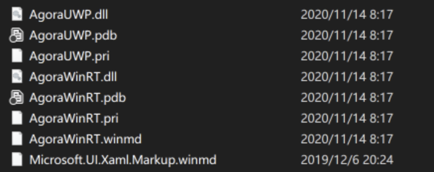
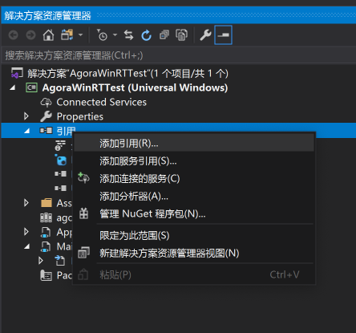
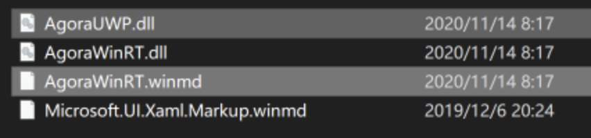

# AgoraWinRT开发说明手册

[**English**](README.md) ｜ *中文*

因为UWP的特殊性，原生Agora C++开发包无法在没有明确申请权限的基础上就得到摄像头和麦克风的使用权限，并且因为窗口句柄的取消，也无法缺省的实现对视频的渲染，另一方面，UWP开发明显对于C#的用户更加友好，特此对Agora C++进行WinRT封装，并在WinRT封装的基础上针对UWP的设备管理和音视频渲染再度封装，从而方便C#用户在UWP平台上进行Agora应用的开发，C++用户也可以参考或直接使用WinRT封装进行开发。

## 架构说明

整个架构分为两个主要部分，AgoraWinRT和AgoraUWP。

AgoraWinRT是对Agora C++的封装，而AgoraUWP则是对AgoraWinRT的封装。

### AgoraWinRT说明

AgoraWinRT针对Agora C++的API进行封装，封装时除了名字空间在AgoraWinRT名字空间下之外，其中的函数名称、类型名称都与Agora C++一致，使用者可直接参考[Agora C++ API Reference for All Platforms](https://docs.agora.io/cn/Audio%20Broadcast/API%20Reference/cpp/index.html)中对应的类型、函数说明进行查找即可。

#### AgoraWinRT没有封装的部分

在AgoraWinRT中，因为各种原因有个别API没有进行封装，以下是列表及原因说明

| API名称                             | 原因说明                                                     |
| ----------------------------------- | ------------------------------------------------------------ |
| setVideoProfile                     | 2.3后废弃                                                    |
| 屏幕共享                            | 技术原因，暂时不封装                                         |
| 人脸检测                            | Android和iOS                                                 |
| 音频播放路由                        | Android和iOS                                                 |
| 耳返控制                            | Android和iOS                                                 |
| 摄像头控制                          | Android和iOS                                                 |
| setAudioSessionOperationRestriction | iOS                                                          |
| queryInterface                      | COM架构                                                      |
| IVideoDeviceManager                 | 视频设备管理部分因具体平台差异，转移至具体平台的封装中实现，比如UWP平台上，详情参考[AgoraUWP说明](#AgoraUWP说明) |
| initialize                          | 集成至类创建中                                               |
| release                             | 集成至dispose方法中                                          |
| setupLocalVideo                     | 转移至具体平台的封装中实现，比如UWP平台上，详情参考[AgoraUWP说明](#AgoraUWP说明) |
| setupRemoteVideo                    | 转移至具体平台的封装中实现，比如UWP平台上，详情参考[AgoraUWP说明](#AgoraUWP说明) |
| setLocalRenderMode                  | 转移至具体平台的封装中实现，比如UWP平台上，详情参考[AgoraUWP说明](#AgoraUWP说明) |
| setRemoteRenderMode                 | 转移至具体平台的封装中实现，比如UWP平台上，详情参考[AgoraUWP说明](#AgoraUWP说明) |
| startPreview                        | 转移至具体平台的封装中实现，比如UWP平台上，详情参考[AgoraUWP说明](#AgoraUWP说明) |
| stopPreview                         | 转移至具体平台的封装中实现，比如UWP平台上，详情参考[AgoraUWP说明](#AgoraUWP说明) |
| enableLocalVideo                    | 转移至具体平台的封装中实现，比如UWP平台上，详情参考[AgoraUWP说明](#AgoraUWP说明) |
| onVideoDeviceStateChanged           | 转移至具体平台的封装中实现，比如UWP平台上，详情参考[AgoraUWP说明](#AgoraUWP说明) |

#### AgoraWinRT项目文件说明

AgoraWinRT项目为Windows Runtime Component（C++ WinRT）项目，其接口定义在几个idl文件中。

| 文件名                           | 用途说明                                                     |
| -------------------------------- | ------------------------------------------------------------ |
| AgoraWinRT.idl                   | 主接口文件，定义了AgoraRtc的接口，为Agora C++ SDK的WinRT重定义版本 |
| AgoraWinRTInterfaces.idl         | 事件接口定义文件，重定义了AgoraRtcEventHandler、MetadataObserver、AudioFrameObserver、VideoFrameObserver, PacketObserver，使用者在自己的类中可选择接口进行实现，并调用相应的注册方法，实现事件订阅 |
| AgoraWinRTAudioDeviceManager.idl | Agora C++ IAudioDeviceManager的WinRT重定义文件               |
| AgoraWinRTChannel.idl            | Agora C++ IChannel和IChannelEventHandler的WinRT重定义文件    |
| AgoraWinRTTypes.idl              | Agora C++ SDK中各种其他类型的WinRT重定义文件                 |
| AgoraWinRTEnums.idl              | Agora C++ SDK中各种枚举类型的WinRT重定义文件                 |

#### AgoraWinRT::AgoraRtc的事件注册

AgoraRtc为AgoraWinRT的核心封装类，其中集中了对Agora C++ SDK的封装，并且通过下表提供Agora C++ RTC部分的事件注册支持

| 注册方法                      | 注册事件                                                     |
| ----------------------------- | ------------------------------------------------------------ |
| RegisterRtcEngineEventHandler | AgoraRtcEventHandler                                         |
| RegisterMediaMetadataObserver | MetadataObserver                                             |
| RegisterPacketObserver        | PacketObserver，基于Agora的内部机制，光注册并不会让这个接口生效，需要在调用EnableEncryption并且enable为true后，本接口中的函数事件才会调用 |
| RegisterAudioFrameObserver    | AudioFrameObserver                                           |
| RegisterVideoFrameObserver    | VideoFrameObserver                                           |

#### AgoraWinRT::AgoraRtc的特殊实现点

AgoraRtc对比Agora C++实现，去除了initialize和release两个接口。因为C++ WinRT本身可以利用C++面对对象的特性，实现在AgoraRtc类创建时自动初始RTC引擎，并且在类析构时自动调用引擎的release方法。同时为了方便.NET平台的资源管理，AgoraRtc实现了IDispose接口，从而用户可以使用using或直接调用dispose方法进行资源的释放。**注意，因为这种实现，用户在调用dispose释放AgoraRtc之后，想要再次利用AgoraRtc，必须重新创建新的AgoraRtc类，并注册事件，而不是像Agora C++ SDK中那样子可以持有引用，并重新initialize。**

#### AgoraWinRT::AgoraRtc的函数和事件接口文档

[如前所述](#AgoraWinRT说明)AgoraRtc中，除了名字空间为AgoraWinRT外，其下所有的函数、类型、枚举类型、接口定义的名称都与Agora C++ SDK中的一致。其意图就是方便开发者直接通过官方的[Agora C++ API Reference for All Platforms](https://docs.agora.io/cn/Audio%20Broadcast/API%20Reference/cpp/index.html)文档查找具体的函数、类型、枚举类型、接口定义的具体说明。所以本处并不提供函数、类型、枚举类型、接口定义的说明文档，开发者可直接参考[官方文档](https://docs.agora.io/cn/Audio%20Broadcast/API%20Reference/cpp/index.html)。

### AgoraUWP说明

AgoraUWP是针对UWP平台实现的对AgoraWinRT的C#封装，并在AgoraWinRT的基础上，提供了VideoDeviceManager、视频采集与渲染功能。同时，缺省的实现了AgoraRtcEventHandler、VideoFrameObserver、AudioFrameObserver三个接口，并将其中的函数转而实现为C#风格的事件。

其实现时的函数、类型、方法等名称原则与AgoraWinRT中一样，除了名字空间为AgoraUWP外，都与Agora C++ SDK中保持一致。

#### AgoraUWP项目文件说明

AgoraUWP项目为类库（通用Windows）项目类型，其中各个文件的说明为：

| 文件名                     | 用途说明                                                     |
| -------------------------- | ------------------------------------------------------------ |
| AgoraUWP.cs                | 本文件为AgoraUWP的主文件，其中包括了AgoraWinRT中AgoraRtc的同名UWP封装，封装中缺省实现AgoraRtcEventHandler、VideoFrameObserver、AudioFrameObserver三个AgoraWinRT接口，并将其转化为C#风格的对应事件。并在封装中提供了对UWP平台的视频采集与渲染的缺省实现，让使用者可以像使用Agora C++ SDK那样，不用考虑视频采集与渲染问题，直接调用SDK的功能即可完成正常的视频通讯与直播。 |
| AgoraUWPDelegate.cs        | AgoraRtcEventHandler、VideoFrameObserver、AudioFrameObserver三个接口对应的C#风格事件的定义文件 |
| IVideoDeviceCollection.cs  | Agora C++ SDK的IVideoDeviceCollection在C#上的重定义          |
| VideoDeviceManager.cs      | Agora C++ SDK的IVideoDevicemanger在C#上的重定义，并且提供IVideoDeviceCollection和IVideoDeviceManager在UWP平台上的C#实现 |
| VideoCanvas.cs             | 因为UWP平台上没有窗口的handle，传统的通过传入窗口handle，在窗口中进行视频渲染的做法无法实现。因此定义了VideoCanvas抽象类，统一UWP平台上视屏渲染的实现接口，具体说明参考[VideoCanvas](#VideoCanvas类说明) |
| ImageBrushVideoCanvas.cs   | 提供基于ImageBrush的VideoCanvas视频渲染实现，用户可以使用这个类在ImageBrush上实现视屏渲染，也可以参考这个类的实现，实现自己的视频渲染实现 |
| IMediaCapturer.cs          | AgoraUWP使用的媒体捕捉器的接口，用户可以通过实现自己的媒体捕捉器以替换AgoraUWP中缺省的媒体捕捉器 |
| GeneralMediaCapturer.cs    | IMediaCapturer接口的缺省实现，也是AgoraUWP缺省使用的媒体捕捉器，用户可以参考这个类的实现，实现自己的媒体捕捉器 |
| MediaCaptureVideoSource.cs | 基于GeneralMediaCapturer的一个Agora VideoSource的实现        |

#### AgoraUWP.AgoraRtc

本类是Agora RTC在UWP平台上的核心封装类，其继承了AgoraWinRT::AgoraRtc类，并实现了AgoraRtcEventHandler、VideoFrameObserver、AudioFrameObserver三个AgoraWinRT接口，同时将其转化为C#风格的对应事件。补充了在AgoraWinRT上没有实现的针对UWP平台的视频捕捉、渲染、视频设备管理功能，实现了setupLocalVideo、setupRemoteVideo、setLocalRenderMode、setRemoteRenderMode、startPreview、stopPreview、enableLocalVideo函数，具体功能请参考[Agora C++ API Reference for All Platforms](https://docs.agora.io/cn/Audio%20Broadcast/API%20Reference/cpp/index.html)中同名函数说明。

在使用AgoraUWP.AgoraRtc类时与使用Agora C++原生实现时有几个不同点：

1. 因为UWP平台的权限管理原因，使用摄像头和麦克风需要申请权限。经过测试，申请权限部分因为有弹窗确认的流程，无法使用同步代码，特别添加RequestCameraAccess异步静态函数，使用者在使用之前需要异步调用本函数已申请权限。
2. 因为UWP平台上无窗口handle，setupLocalVideo与setupRemoteVideo函数参数改为接受VideoCanvas参数，任何继承并实现了VideoCanvas的类都可以正确得到需要渲染的视频帧数据，用户需要自己实现其在UWP窗体上的视频渲染，或者使用AgoraUWP.ImageBrushVideoCanvas从而直接在ImageBrush上实现视频渲染。

#### AgoraUWP.IMediaCapturer和AgoraUWP.GeneralMediaCapturer

IMediaCapturer定义了一个在UWP上的音视频帧捕捉器，而GeneralMediaCapturer则是它的缺省实现了。

GeneralMediaCapturer本身不但被AgoraUWP.AgoraRtc作为内部视频帧捕捉器使用，同时也可以作为音视频自采集时的音视频帧捕捉器独立使用。

IMediaCapturer定义说明如下：

1. VideoDevice

   得到当前捕捉器所使用的视频设备，可能为null

2. AudioDevice

   得到当前捕捉器所使用的音频设备，可能为null

3. AudioFormat

   当前使用的音频格式数据，如采样率、声道数等，具体可参考msdn中关于[MediaFrameFormat](https://docs.microsoft.com/en-us/uwp/api/Windows.Media.Capture.Frames.MediaFrameFormat?redirectedfrom=MSDN&view=winrt-19041)部分

4. VideoFormat

   当前使用的视频格式数据

5. VideoBufferType

   当前给出的视频数据buffer的格式，缺省为 VIDEO_BUFFER_RAW_DATA

6. OnVideoFrameArrived

   当采集到视频帧数据时触发

7. EnableVideo

   是否开启视频帧采集，缺省为true，如果设置为false，则OnVideoFrameArrived不会触发

8. OnAudioFrameArrived 

   但采集到音频帧数据时触发

9. EnableAudio

   是否开启采集音频帧，缺省为true，如果设置为false，则OnAudioFrameArrived不会触发

#### VideoCanvas和ImageBrushVideoCanvas

VideoCanvas定义了可被AgoraUWP.AgoraRtc接受为本地SetupLocalVideo与远程SetupRemoteVideo视频渲染窗口所应实现的方法和属性。

ImageBrushVideoCanvas则是基于ImageBrush之上的VideoCanvas实现类。

VideoCanvas定义说明如下：

1. Target

   需要在其上进行渲染的对象，比如ImageBrushVideoCanvas中的ImageBrush对象

2. RenderMode

   视频在视频渲染窗口的填充方式

3. Channel

   视频对应来源的频道

4. User

   视频对应的用户id

5. MirrorMode

   视频是否需要镜像显示

6. Render(MediaFrameReference)

   本地的视频预览时所使用的渲染方法

7. Render(VideoFrame)

   AgoraUWP.AgoraRtc进行本地和远程视频渲染时调用的方法

VideoCanvas类为抽象类，其中两个Render被实现为虚方法，方便用户根据需要对两个方法进行有选择的单独实现，比如VideoDeviceManager的StartDeviceTest中的VideoCanvas就可以只实现Render(MediaFrameReference)，因为这个函数中VideoCanvas只在本地视频测试中使用。

#### MediaCaptureVideoSource

Agora C++中提供了一个setVideoSource的方法，让用户可以提供自己的VideoSource，但是在Agora的示例中，自定义的视频采集是以视频自采集setExternalVideoSource和pushVideoFrame两个方法进行的。本类只是提供了一个基于GeneralMeidaCapturer进行自定义的VideoSource的例子，用户可以参考其实现自己的VideoSource。

## 使用实例说明

AgoraUWPDemo为调用AgoraUWP的示例。

例子中演示了三种模式：

1. 使用SDK内部采集模式

   直接使用SDK内部的音视频采集，用户不用关心采集部分，只用关心业务部分。

2. 使用音频自采集

   演示了如何进行使用GeneralMediaCapturer进行音频自采集，作为示例，使用者可参考并实现自己的音频自采集方法。

3. 使用音频自渲染

   演示了如何使用[AudioGraph](https://docs.microsoft.com/en-us/uwp/api/windows.media.audio.audiograph?view=winrt-19041)结合[PullAudioFrame](https://docs.agora.io/cn/Video/API%20Reference/cpp/classagora_1_1media_1_1_i_media_engine.html#aaf43fc265eb4707bb59f1bf0cbe01940)对外部音频进行渲染。

同时示例中还演示了如何调整分辨率、帧率、码率等。

### 使用SDK内部采集模式流程

本流程对应着[如何快速开始](https://docs.agora.io/cn/Video/start_call_windows?platform=Windows)一节


请注意，因为UWP平台限制，必须对摄像头和麦克风权限进行申请才可以使用，所以在初始化之前，用户需要先调用AgoraUWP.AgoraRtc.RequestCameraAccess异步方法进行权限申请，因为是异步，这个方法推荐在程序一开始比如界面显示时进行，而把真正初始化AgoraRtc对象放置在真正开始需要进行视频通话的时候再进行，否则会造成AgoraRtc无法获得设备权限。

### 使用音频自采集

本流程对应[自定义音频采集和渲染](https://docs.agora.io/cn/Video/custom_audio_windows?platform=Windows)一节中的前半部，自定义音频采集


在演示中

```c#
/// <summary>
/// 演示如何进行音频自采集和自渲染
/// </summary>
/// <param name="sender"></param>
/// <param name="e"></param>
private void StartEngineAndSelfAudioProcess()
{
    InitEngine();
    InitAudioCapture();
    this.engine.SetExternalAudioSource(true, m_audioCapture.AudioFormat.AudioEncodingProperties.SampleRate, (byte)m_audioCapture.AudioFormat.AudioEncodingProperties.ChannelCount);
}
```

除了初始化引擎外，还初始化了一个基于GeneralMediaCapturer实现的音频采集器

```c#
private void InitAudioCapture()
{
    var sourceGroup = MediaFrameSourceGroup.FindAllAsync().AsTask().GetAwaiter().GetResult();
    if (sourceGroup.Count == 0) return;
    m_audioCapture = new GeneralMediaCapturer(sourceGroup[0], StreamingCaptureMode.Audio);
    m_audioCapture.OnAudioFrameArrived += AudioFrameArrivedEvent;
}
```

在这个音频采集器中，当采集到音频数据时，AudioFrameArrivedEvent被触发，将采集到的PCM32的音频数据转化为Agora能处理的PCM16的音频数据后，通过PushAudioFrame进行发送

```c#
private void AudioFrameArrivedEvent(AudioMediaFrame frame)
{
    using (Windows.Media.AudioFrame rawAudioFrame = frame.GetAudioFrame())
        using (AudioBuffer audioBuffer = rawAudioFrame.LockBuffer(AudioBufferAccessMode.Read))
        using (AgoraWinRT.AudioFrame audioFrame = new AgoraWinRT.AudioFrame())
    {
        var buffer = Windows.Storage.Streams.Buffer.CreateCopyFromMemoryBuffer(audioBuffer);
        buffer.Length = audioBuffer.Length;
        using (var dataReader = DataReader.FromBuffer(buffer))
        {
            dataReader.ByteOrder = ByteOrder.LittleEndian;
            byte[] tmp = new byte[buffer.Length / 2];
            int pos = 0;
            while (dataReader.UnconsumedBufferLength > 0)
            {
                var int16Data = (Int16)(dataReader.ReadSingle() * Int16.MaxValue);
                byte[] chunck = BitConverter.GetBytes(int16Data);
                tmp[pos++] = chunck[0];
                tmp[pos++] = chunck[1];
            }
            var format = frame.AudioEncodingProperties;
            audioFrame.bytesPerSample = 2;
            audioFrame.channels = (byte)format.ChannelCount;
            audioFrame.samplesPerSec = format.SampleRate;
            audioFrame.samples = (uint)(tmp.Length / 4);
            audioFrame.type = AUDIO_FRAME_TYPE.FRAME_TYPE_PCM16;
            audioFrame.buffer = tmp;
            engine.PushAudioFrame(audioFrame);
        }
    }
}
```

本示例和官方的示例是有差别的，官方使用了一个队列，确保声音数据不因处理的时间问题而丢失，本示例没有进行这方面的处理，使用者可以根据自己应用的需要参考[官方示例](https://docs.agora.io/cn/Video/custom_audio_windows?platform=Windows)实现。

### 使用音频自渲染

本流程对应[自定义音频采集和渲染](https://docs.agora.io/cn/Video/custom_audio_windows?platform=Windows)一节中的后半部分，自定义音频渲染


在演示中

```c#
private void StartEngineAndPullAudioProcess()
{
    InitEngine();
    InitAudioGraph();
    log("Set External Audio Sink", this.engine.SetExternalAudioSink(true, DEFAULT_SAMPLE_RATE, (byte)DEFAULT_CHANNEL_COUNT));
}
```

除了初始化AgoraRtc引擎外，还初始化了一个[AudioGraph](https://docs.microsoft.com/en-us/uwp/api/windows.media.audio.audiograph?view=winrt-19041)作为音频播放器。

```c#
private void InitAudioGraph()
{
    var settings = new AudioGraphSettings(AudioRenderCategory.Media);
    var createGraphResult = AudioGraph.CreateAsync(settings).AsTask().GetAwaiter().GetResult();
    m_audioGraph = createGraphResult.Graph;
    var outputResult = m_audioGraph.CreateDeviceOutputNodeAsync().AsTask().GetAwaiter().GetResult();

    m_audioInput = m_audioGraph.CreateFrameInputNode(
        new AudioEncodingProperties
        {
            BitsPerSample = DEFAULT_BITS_PER_SAMPLE,
            ChannelCount = DEFAULT_CHANNEL_COUNT,
            SampleRate = DEFAULT_SAMPLE_RATE,
            Subtype = MediaEncodingSubtypes.Pcm,
        });
    m_audioInput.QuantumStarted += QuantumStartedEvent;
    m_audioInput.AddOutgoingConnection(outputResult.DeviceOutputNode);
    m_audioInput.Stop();
}
```

其中m_audioInput作为PCM数据的输入端，链接至缺省的系统音频输出端，比如扬声器或耳机。每当m_audioInput准备好可以处理新的音频数据时，会触发QuantumStarted事件，在这个事件中就可以调用Agora的PullAudioFrame得到音频数据并进行处理后播放。

```c#
private void QuantumStartedEvent(AudioFrameInputNode sender, FrameInputNodeQuantumStartedEventArgs args)
{
    using (var frame = new AgoraWinRT.AudioFrame())
    {
        frame.bytesPerSample = 2;
        frame.channels = (byte)DEFAULT_CHANNEL_COUNT;
        frame.samplesPerSec = DEFAULT_SAMPLE_RATE;
        frame.type = AUDIO_FRAME_TYPE.FRAME_TYPE_PCM16;
        frame.renderTimeMs = 0;
        frame.samples = DEFAULT_SAMPLE_RATE / 100;
        var result = engine.PullAudioFrame(frame);
        if (result == 0) PlayAudioFrame(frame);
    }
}

 private unsafe void PlayAudioFrame(AgoraWinRT.AudioFrame frame)
 {
     using (var audioFrame = new Windows.Media.AudioFrame((uint)frame.buffer.Length))
     {
         using (var buffer = audioFrame.LockBuffer(AudioBufferAccessMode.Write))
             using (var reference = buffer.CreateReference())
         {
             byte* data;
             uint size;
             ((IMemoryBufferByteAccess)reference).GetBuffer(out data, out size);
             fixed (byte* raw = frame.buffer)
             {
                 System.Buffer.MemoryCopy(raw, data, size, size);
             }
         }
         m_audioInput?.AddFrame(audioFrame);
     }
 }
```

## 如何在UWP 项目中使用

如果要在一个新的或已经存在的 UWP 项目中使用 AgoraUWP 和 AgoraWinRT，只需如下几步，这里以一个新的 UWP 项目为例

### 生成库文件

编译完 AgoraWinRT 和 AgoraUWP 项目后，在 AgoraUWP 项目的 bin/x86 或 bin/x64 下生成 debug 或 release 目录，具体活动解决方案配置与活动解决方案平台依编译时的设置而定。



其中需要的文件是

1. AgoraUWP.dll
2. AgoraWinRT.dll
3. AgoraWinRT.winmd

### 新建 UWP 项目

通过Visual Studio新建一个 UWP 项目


### 添加 Agora C++ RTC 库文件

在 AgoraWinRTTest 项目中选择添加“现有项“


找到从 Agora 官网上下载的 Agora RTC SDK，选择其中的 agora_rtc_sdk.dll，注意要选择对应的 x86 或x64 版本。


将 agora_rtc_sdk.dll 的属性中的复制到输出目录选择为“始终复制”


### 添加 AgoraWinRT 和 AgoraUWP 引用

在项目中选择添加引用



选择浏览


点击“浏览”按键后，在文件浏览器中找到生成的库文件目录，选择 AgoraUWP.dll 和 AgoraWinRT.winmd这两个文件



点击“添加”


点击“确定”，就可以将 AgoraUWP 和 AgoraWinRT 库添加到项目中了。


### 最后

之后的使用就可以参考 AgoraWinRT 工程里的 AgoraUWPDemo 项目 了，注意，项目需要添加麦克风和网络摄像头的功能才可以。


